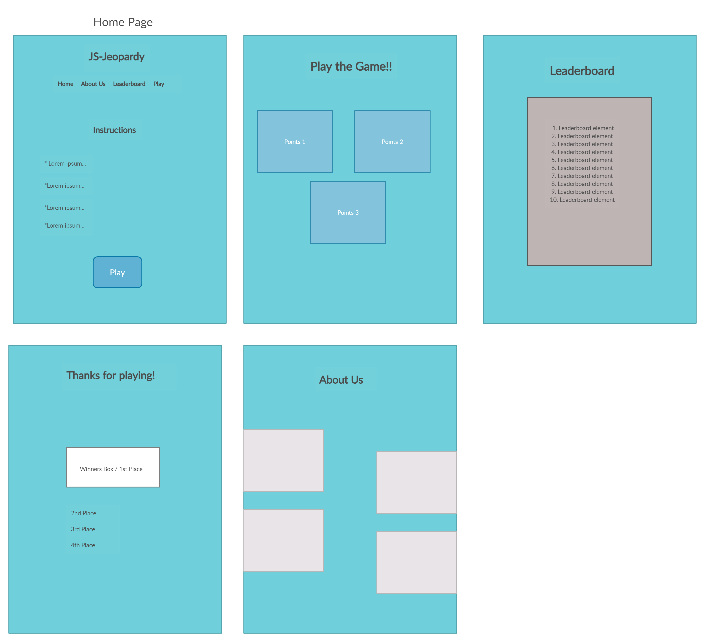
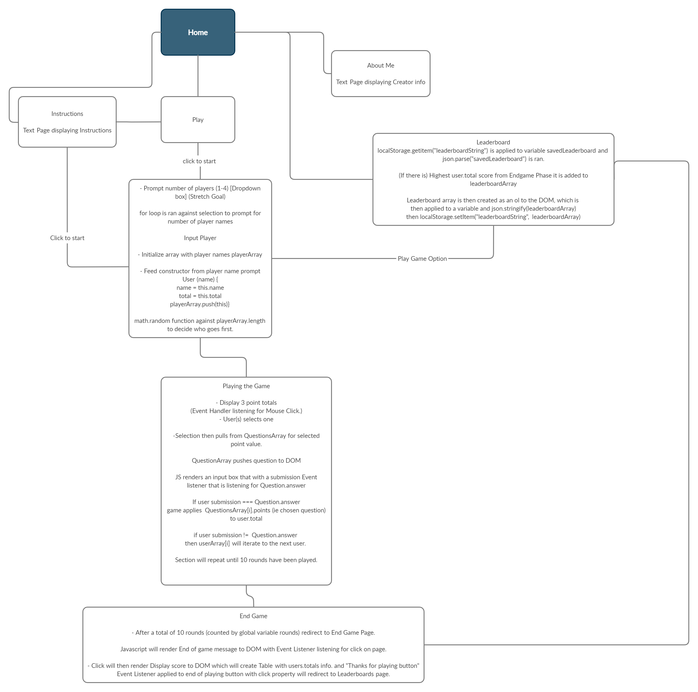

# JS-Jeopardy
**Team:** Davion Garcia, Colton Christensen, Jacque Young, Terrence Simms

**Project Tools:**

Project Manager: https://trello.com/invite/b/UNhmjSrB/7bb12b5ec886ce8e01913e9cd179ad13/development-board

**The Project manager our team is using is Trello from Atlassian**

Team Agreement: https://docs.google.com/document/d/1Llv505vHiv2D1VTjsT4Irzr48J3JH_BQbjth7mTp4B0/edit

**The Agreement for our team including our work hours, Conflict plan, and Git flow.**

Domain Model Creation tool: https://app.creately.com/diagram/WGywF0YwgN5/edit

**Our tool for creating all of our graphical assets, our wireFrame(Included below) and our Domain Model(Included below)**

